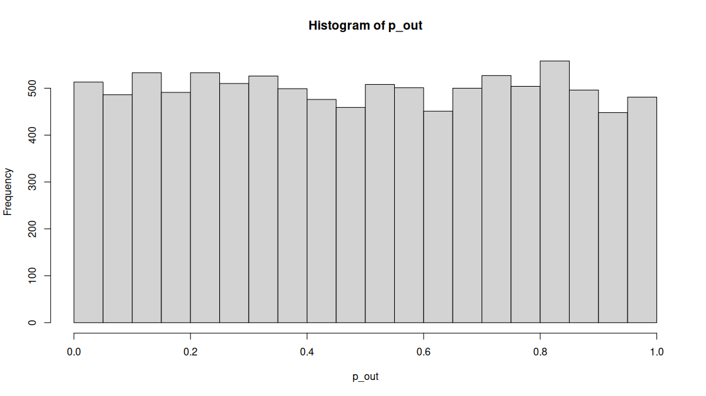

In this part of the assignment, I simulated data to test if there is a relationship between the number of previous relationships and the match rate in online dating, assuming there is no real relationship (the null hypothesis is true).

I first created two variables: `PreviousRelationships` (the number of past relationships) and `MatchRate` (the percentage of matches). These two variables were simulated randomly, meaning there was no real connection between them. I then ran 1,000 simulations, each time performing a linear regression to check if there was a significant relationship between the two variables.

Next, I calculated the p-values for each simulation to see how often I would reject the null hypothesis by chance. The expected Type I error rate is 5%, meaning 5% of the p-values should be below 0.05 even if the null hypothesis is true. After running all simulations, I found that the Type I error rate was 5.8%, which is close to the expected 5%.

I created a histogram to show the distribution of the p-values from all simulations. In the graph, the red line at p = 0.05 shows the threshold for rejecting the null hypothesis. The area to the left of this line represents the percentage of times I incorrectly rejected the null hypothesis, which was about 5.8% of the time, just above the expected 5%.

This analysis confirms that the Type I error rate is as expected, and the simulation is working correctly.

